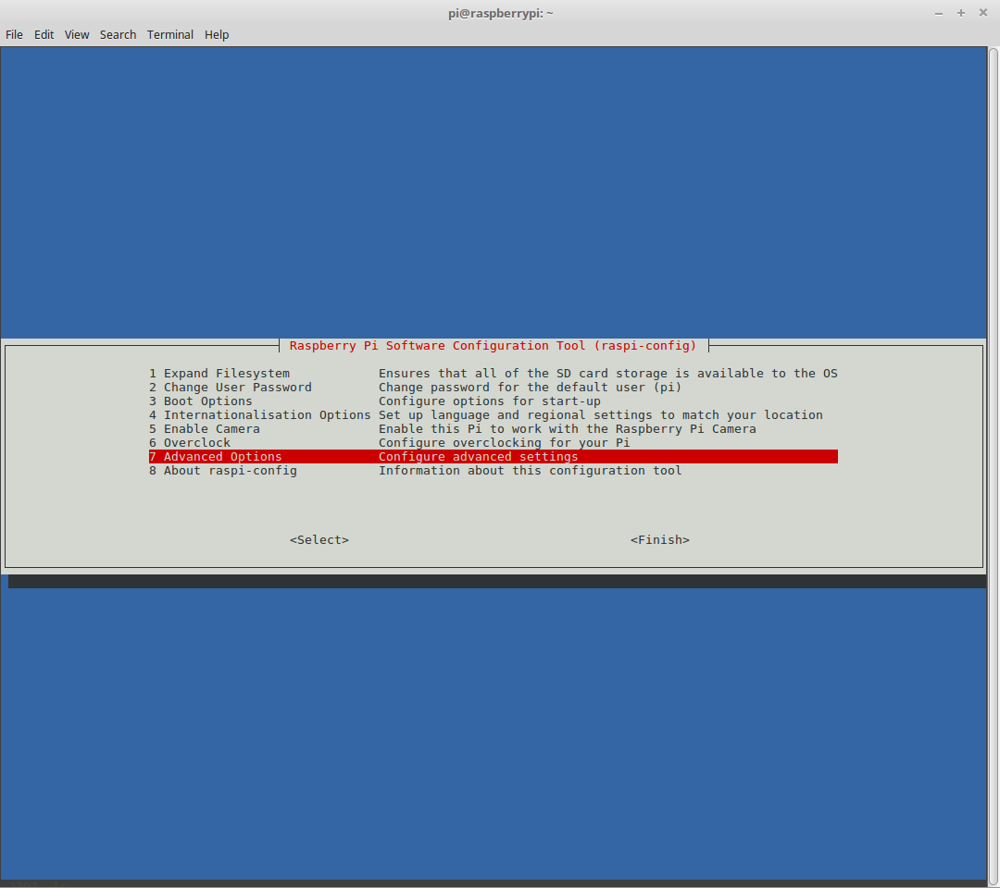
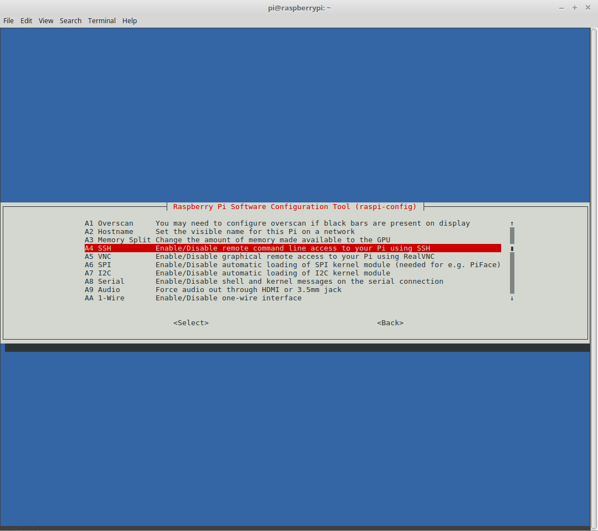
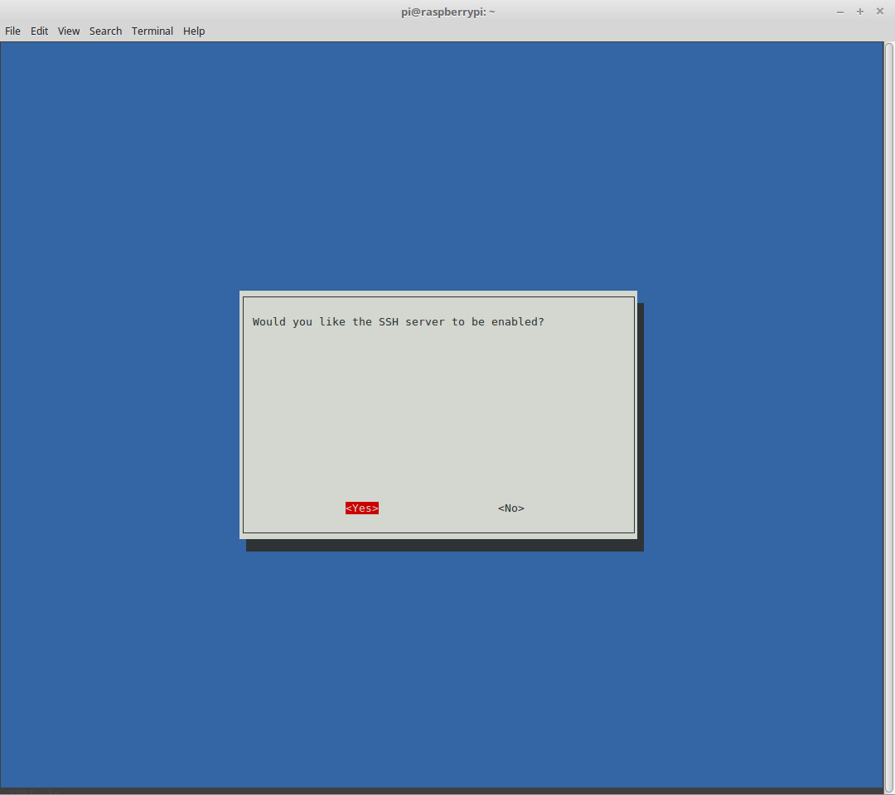
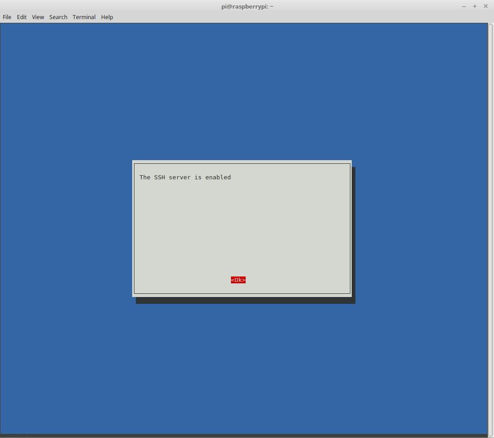

Raspberry Pi Setup
==================

    A Raspberry Pi is a computer, roughly the size of a cell phone, that can be used to run Linux, power internet of things applications, or even serve as a low power personal computer (mostly good for things like watching Youtube videos or doing simple text editing). These devices are inexpensive, which makes them great resources for learning computer science, simulating network applications, and launching low resource applications. They can be used to run Minecraft servers, web applications, databases, and even have first class support for containerization using Docker.

    This document explains how to get a Raspberry Pi connected to a home network, in a reasonably secure way. This will not go into very much depth for configuration of the Raspberry Pi, but will instead aim to make the minimum number of changes to get the device online over SSH, using an RSA keypair for authentication instead of a password.

- `Getting and Verifying an OS`_
- `Flashing the Image to a micro SD card`_
- `Power on the Pi`_

Getting and Verifying an OS
---------------------------

    Getting an operating system loaded onto a Raspberry Pi is a relatively straightforward process. Because each Pi uses a micro SD card as its hard drive, all you have to do is copy a preconfigured operating system onto the micro SD card, plug the SD card into your Raspberry Pi, and power it on.

    There are a number of available operating systems. This tutorial assumes you're working with one of the officially supported Raspbian images, but if you prefer, you can install a different platform, such as CentOS or Kali Linux. As far as I know, no operating system aside from official Raspbian images include the **raspi-config** program, so if you do use a different platform, you'll have to figure things out for yourself.

    First, download the image you want to use. I prefer the *Lite* version of whatever the latest Raspbian build is - currently, it looks like they're on Stretch. You can download the image from `the official site <https://www.raspberrypi.org/downloads/raspbian/>`_. It's considered a good practice to verify the signature to ensure your download checksum matches the published checksum. You can do this by running the **sha256sum** command (or the equivalent for whatever algorithm they used to generate the checksum with) against the file, and comparing it to the published checksum, which should be on the website you downloaded the image from.

.. code:: bash

    $ sha256sum 2017-09-07-raspbian-stretch-lite.zip

Once you've verified your OS, you can go ahead and decompress it. If it's stored as a **zip** archive, you can do this using the **unzip** command.

.. code:: bash

    $ unzip 2017-09-07-raspbian-stretch-lite.zip

This should create a new file with the same name, but a **img** extension instead of **zip**. In my case, the file is called **2017-09-07-raspbian-stretch-lite.img**

Flashing the Image to a micro SD card
-------------------------------------

    Before flashing the device, you need to check and see which filesystems are currently mounted on your machine. You can do this using the **df** (disk format) command. The reason you're checking to see which filesystems are mounted on your machine is that these filesystems are all in use, and if you write the Raspbian image onto one of them, you run the risk of catastrophic data loss or trashing the OS on your workstation. We want to avoid these outcomes.

.. code:: bash

    $ df -h

Now, plug your micro SD card into your machine (or into an adapter, which you can then plug into your machine), and run the same command a second time to see which new filesystem was added. This filesystem is on the disk you'll eventually want to flash the image to. If you've used the SD card before, you may see more than one filesystem added, such as **/dev/sdc1** and **/dev/sdc2**. If this is the case, record all new filesystems that appear, since we'll need to unmount each of them in order to use the full SD card.

.. code:: bash

    $ df -h

Unmount the file systems that are associated to your SD card. Be careful not to unmount any of the original filesystems you saw, only unmount the new ones. You will also want to record the basename of the filesystems that you unmount. This represents the disk, or SD card, and will be everything before the integer, so if your filesystem is **/dev/sdc1**, your disk will be **/dev/sdc**.

.. code:: bash

    $ umount /dev/sdc1
    $ umount /dev/sdc2

At last, we can flash the image to the SD card. Use the **dd** utility to flash the image. **dd** takes several parameters. **bs=4M** tells the utility to write up to four megabytes at a time. **if=2017-09-07-raspbian-stretch-lite.img** tells the utility that the file we're writing as an image is the one we just decompressed. **of=/dev/sdc** tells the utility that the drive we want to write to is the one we've just unmounted all filesystems from.

.. code:: bash

    $ sudo dd bs=4M if=2017-01-11-raspbian-jessie-lite.img of=/dev/sdc

Finally, we should run **sync** to ensure any buffers are cleared, so that we don't corrupt the image we just wrote by unplugging the SD card before it is safe to do so. Once this command returns, we can unplug the SD card and plug it into the Raspberry Pi.

.. code:: bash

    $ sync

Power on the Pi
---------------

Before turning the Raspberry Pi on, plug in a keyboard and monitor. We'll need them in order to enable remote access, and the Pi won't recognize these peripherals if we plug them in after booting it up.

Enable SSH
----------

Log into the Raspberry Pi, using the default username "pi" and default password "raspberry". Once logged in, enter the config and use the Advanced Options to enable SSH.

.. code:: bash

    $ sudo raspi-config

    

Finally, reboot the Raspberry Pi to ensure the updated settings take effect. After this, you can unplug the monitor and keyboard, as they are no longer needed. Instead, this time when you boot the Pi up, make sure it has an ethernet cable connecting it to your router.

.. code:: bash

    $ sudo shutdown -r now

Give Pi Static IP Address
-------------------------

For many applications, such as running a local web server or API, it is important that the Raspberry Pi has a static internal IP address, so that you don't have to update port forwarding rules or connection details every time your router or Raspberry Pi is rebooted. The easiest way to ensure this is to use your router's administration panel to give your Raspberry Pi a reserved IP address.

The process for this is different for every router, but it should follow something along the lines of logging into your router's admin page, navigating to a network settings panel, and reserving the IP address that your Raspberry Pi is currently using. This ensures that the Raspberry Pi will always be given the same IP address. After reserving your IP address, you may need to reboot your router.

Additionally, you can update the setting in your Raspberry Pi to make sure it always starts with the same IP address. If you do this instead of the DHCP reservation, be sure to pick an IP address outside the DHCP range, so that DHCP doesn't also assign the IP address selected to another device on the network, creating a conflict.

First, find the IP address of your Raspberry Pi. If you're able to log into your router, you can simply check the list of devices. If not, you can use **arp-scan** to detect all devices on your network, and try each until you find which one is the Pi.

.. code:: bash

    $ sudo arp-scan --localnet

In my case, the IP address was **192.168.0.11**. Now, try to log in.

.. code:: bash

    $ ssh pi@192.168.0.11

Once you've logged in, edit the **/etc/dhcpcd.conf** file to set the IP address you want your Raspberry Pi to have. These lines should be appended to the bottom of the file. You can use whichever terminal editor you like best, I prefer **vi**.

.. code:: bash

    # Set IP address to 192.168.0.11
    interface eth0
    static ip_address=192.168.0.11/32
    static routers=192.168.0.1

Note that your values for IP address and routers may be different. If you want the IP address to be in a range, modify the CIDR code associated with the IP address. /32 denotes that there are no bits in the bitmask, so the IP range only contains the one address specified.

After you've done this, reboot your Raspberry Pi, and ensure that it comes back online at the IP address you specified.

.. code:: bash

    $ sudo shutdown -r now

Establish RSA Public Key Authentication
---------------------------------------

On your local machine, generate an RSA Key.

.. code:: bash

    $ cd ~/.ssh
    $ ssh-keygen -t rsa -b 4096

Assuming you named it *id_rsa* and the public key is *id_rsa.pub*, you need to copy id_rsa.pub over to the Raspberry Pi and append it to the authorized_keys file.

.. code:: bash

    $ cd ~/.ssh
    $ scp id_rsa.pub pi@192.168.0.11:/home/pi/.ssh/id_rsa.pub

    $ ssh pi@192.168.0.11
    $ cd .ssh
    $ cat id_rsa.pub >> authorized_keys

After this, you'll need to update the ssh settings on your Raspberry Pi.

.. code:: bash

    $ vi /etc/ssh/sshd_config

Here, you'll need to change these two lines

.. code:: bash

    # Uncomment the line setting the authorized keys file:
    AuthorizedKeysFile      %h/.ssh/authorized_keys

    # Disallow password login over ssh:
    PasswordAuthentication no

Finally, restart the Pi to make these changes take effect.

.. code:: bash

    $ sudo shutdown -r now

On your local development machine, create a .ssh/config file if none exists, and append the host information for your Raspberry Pi.

.. code:: bash

    $ vi ~/.ssh/config
    
    Host    rpi
        HostName        192.168.0.11
        User            pi
        Port            22
        IdentityFile    ~/.ssh/id_rsa

Now you should be able to log into the Raspberry Pi as follows:

.. code:: bash

    $ ssh rpi

Depending on the default settings, you may need to edit the permissions of your key files before you will be allowed to use them for SSH authentication. In particular, you'll need to remove any permissions held by "group" or "other".

Changing the Raspberry Pi Password
----------------------------------

This is a good policy - change the password from the default. Log into the Pi and run the "passwd" command to update the password. Follow the prompts.

.. code:: bash

    $ ssh rpi
    $ passwd

